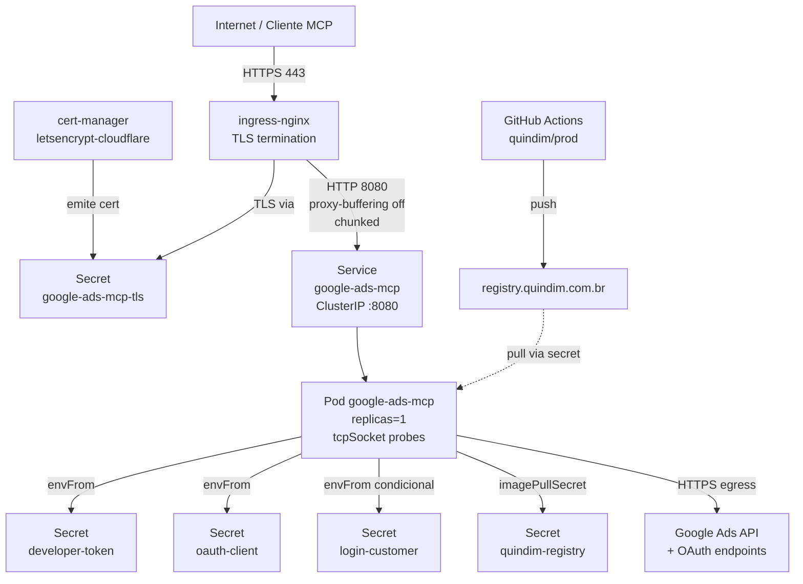

# Helm Chart Deployment — Design

**Spec**: `.specs/features/helm-deployment/spec.md`
**Status**: Draft

> Implementação de referência: `DEPLOY_SPECS.md` (raiz do repo). Este
> documento traduz aquele plano em arquitetura + componentes + reuse,
> rastreando IDs do `spec.md` (ex.: `HELM-01`, `TLS-02`).

---

## Architecture Overview

Deploy single-replica do FastMCP via Helm chart próprio, com TLS
edge-terminated em ingress-nginx (cert-manager + DNS-01 Cloudflare), auth
OAuth-only (FastMCP `GoogleProvider`) e CI isolado da branch upstream.



### Fluxo de uma chamada MCP

1. Cliente MCP faz `POST https://google-ads-mcp.qndm.cc/mcp` (streamable-http).
2. ingress-nginx termina TLS, encaminha para `Service:8080` sem buffer.
3. FastMCP `GoogleProvider` valida o token OAuth do usuário (escopo `adwords`).
4. Tool handler chama `utils.get_googleads_service(...)`.
   `_create_credentials()` usa `get_access_token()` (per-request); ADC seria
   fallback mas não é montado em prod (D6).
5. `MCPHeaderInterceptor` injeta headers de telemetria; resposta em streaming
   chunked.

---

## Code Reuse Analysis

### Existing Components to Leverage

| Component                                                  | Location                              | How to Use                                                                                  |
| ---------------------------------------------------------- | ------------------------------------- | ------------------------------------------------------------------------------------------- |
| `coordinator.py` (FastMCP singleton + `GoogleProvider`)   | `ads_mcp/coordinator.py`              | Sem mudança — chart só injeta env vars que já são lidas no import.                         |
| `server.run_server()`                                      | `ads_mcp/server.py`                   | Sem mudança — escolhe `streamable-http` quando `OAUTH_CLIENT_ID/_SECRET` presentes.       |
| `utils._create_credentials()` (two-tier: token → ADC)     | `ads_mcp/utils.py`                    | Sem mudança — em prod só tier 1 é usado; tier 2 falha por falta de ADC, que é o desejado. |
| Dockerfile upstream (entry point `google-ads-mcp`)        | raiz (`Dockerfile`)                   | Reusar; chart usa `command: ["google-ads-mcp"]`. Roda como root (limitação D18).            |
| `quindim-registry` pull secret existente                  | namespace fonte (ex. `quindim-mcp`)   | Replicado via `copy-pull-secret.sh`.                                                       |
| `ClusterIssuer/letsencrypt-cloudflare`                    | cluster `quindim`                     | Referenciado em annotation do Ingress.                                                     |

### Integration Points

| System                           | Integration Method                                                                                                       |
| -------------------------------- | ------------------------------------------------------------------------------------------------------------------------ |
| ingress-nginx (`IngressClass/nginx`) | Recurso `Ingress`, host `google-ads-mcp.qndm.cc`, annotations específicas para streamable-http (TLS-02).             |
| cert-manager                     | Annotation `cert-manager.io/cluster-issuer` no Ingress; cert-manager cria `Certificate` e popula Secret automaticamente. |
| Google Ads API                   | Egress HTTPS (sem egress policy); requer dev token + OAuth token.                                                        |
| Google OAuth                     | `redirect_uri = https://google-ads-mcp.qndm.cc/auth/callback` registrado no GCP Console (pré-requisito manual).          |
| GitHub Actions                   | Workflow novo `.github/workflows/build-image.yaml`, trigger só em `quindim/prod` + tags `v*.*.*`.                        |
| Registry `registry.quindim.com.br` | Push via CI; pull via `quindim-registry` Secret.                                                                        |

### Não-reuso (decisão)

- **Sem subcharts/umbrella** — chart é self-contained.
- **Sem `lookup` no template** — chart NUNCA lê estado do cluster em runtime;
  permite `helm template` offline e CI pre-flight.
- **Sem criação de Secrets pelo chart** — contrato com operador é "scripts
  criam, chart referencia" (D10/D11).

---

## Components

### `helm_chart/google_ads_mcp/Chart.yaml`

- **Purpose**: Metadata do chart.
- **Location**: `helm_chart/google_ads_mcp/Chart.yaml`
- **Interfaces** (campos Helm v2):
  - `apiVersion: v2`, `name: google-ads-mcp`, `type: application`,
  - `version: <chart-semver>` (independente de `appVersion`),
  - `appVersion: <git-tag>` (sincronizado com release),
  - `kubeVersion: ">=1.28.0-0"`.
- **Dependencies**: nenhuma.
- **Reuses**: convenções Helm v3.
- **Cobre**: HELM-01.

### `helm_chart/google_ads_mcp/values.yaml`

- **Purpose**: Defaults sensatos + contrato com o operador.
- **Location**: `helm_chart/google_ads_mcp/values.yaml`
- **Interfaces**: chaves descritas em §5.1 do `DEPLOY_SPECS.md`. Resumo:
  - `image.{repository,tag,pullPolicy,pullSecrets}` — `tag: ""` força override.
  - `app.{baseUrl,redirectPath,loginCustomerId,extraEnv}`.
  - `secrets.{developerToken.name,oauthClient.name,loginCustomer.{name,enabled}}`.
  - `replicaCount: 1`.
  - `resources` (`requests: 100m/256Mi`, `limits: 500m/512Mi`).
  - `probes.{liveness,readiness}` com `tcpSocket: { port: http }`.
  - `podSecurityContext: {}`, `containerSecurityContext` (drop caps + seccomp).
  - `serviceAccount.{create,name,automountServiceAccountToken}` (default
    `automount=false`).
  - `service.{type: ClusterIP, port: 8080}`.
  - `ingress.{enabled, className, host, path, pathType, tls, annotations}`.
- **Dependencies**: `_helpers.tpl` (validações).
- **Reuses**: pattern Bitnami-like.
- **Cobre**: HELM-01, HELM-02, HELM-03, TLS-02, HARD-01, HARD-02, OPS-01,
  SEC-03 (toggle `loginCustomer.enabled`).

### `helm_chart/google_ads_mcp/values.example.yaml`

- **Purpose**: Exemplo comentado para o operador (referência rápida; não é
  consumido pelo Helm).
- **Location**: `helm_chart/google_ads_mcp/values.example.yaml`
- **Reuses**: estrutura de `values.yaml`.

### `helm_chart/google_ads_mcp/templates/_helpers.tpl`

- **Purpose**: Helpers comuns + validações fail-fast.
- **Location**: `helm_chart/google_ads_mcp/templates/_helpers.tpl`
- **Interfaces** (templates):
  - `{{ include "google-ads-mcp.fullname" . }}` — `<release>-<chart>`
    truncado a 63 chars.
  - `{{ include "google-ads-mcp.labels" . }}` — labels padrão
    (`app.kubernetes.io/{name,instance,version,managed-by,part-of}`).
  - `{{ include "google-ads-mcp.selectorLabels" . }}` — só selector.
  - `{{ include "google-ads-mcp.image" . }}` — `repo:tag`, com `fail
    "image.tag is required"` se vazio.
  - `{{ include "google-ads-mcp.serviceAccountName" . }}` — fullname ou
    override.
- **Dependencies**: nenhuma (template puro).
- **Cobre**: HELM-02.

### `helm_chart/google_ads_mcp/templates/serviceaccount.yaml`

- **Purpose**: SA dedicada, `automountServiceAccountToken: false`.
- **Location**: `helm_chart/google_ads_mcp/templates/serviceaccount.yaml`
- **Interfaces**: criada se `serviceAccount.create=true` (default).
- **Cobre**: HARD-01.

### `helm_chart/google_ads_mcp/templates/deployment.yaml`

- **Purpose**: Deployment 1-replica com envFrom Secrets externos, probes
  tcpSocket, resources, security context.
- **Location**: `helm_chart/google_ads_mcp/templates/deployment.yaml`
- **Interfaces**:
  - `spec.replicas: {{ .Values.replicaCount }}`.
  - `spec.strategy: { type: RollingUpdate, rollingUpdate: { maxSurge: 1, maxUnavailable: 0 } }`.
  - `containers[0]`:
    - `name: app`,
    - `image: {{ include "google-ads-mcp.image" . }}`,
    - `command: ["google-ads-mcp"]`,
    - `ports: [{ name: http, containerPort: 8080 }]`,
    - `env`: `PORT=8080`, `GOOGLE_ADS_MCP_BASE_URL`, opcional
      `GOOGLE_ADS_MCP_REDIRECT_PATH`, `extraEnv` (interpolado via `tpl`),
    - `envFrom`: 2 ou 3 `secretRef` conforme `secrets.loginCustomer.enabled`,
    - `resources` do values,
    - `livenessProbe` / `readinessProbe`: `tcpSocket: { port: http }`,
    - `securityContext`: `containerSecurityContext` do values.
  - `serviceAccountName`: helper.
  - `imagePullSecrets`: `image.pullSecrets`.
  - **Sem volumes** (Dockerfile atual não exige writable mounts; quando
    `readOnlyRootFilesystem` for ligado no futuro, montar `emptyDir` em
    `/tmp`).
- **Cobre**: HELM-01, HELM-03, OPS-01, OAUTH-01, OAUTH-02, SEC-03, HARD-02.

### `helm_chart/google_ads_mcp/templates/service.yaml`

- **Purpose**: ClusterIP `:8080` apontando para `targetPort: http`.
- **Location**: `helm_chart/google_ads_mcp/templates/service.yaml`
- **Interfaces**: porta única `8080`, sem porta de métricas (não há
  `/metrics` em FastMCP 3.2.x).
- **Cobre**: HELM-01.

### `helm_chart/google_ads_mcp/templates/ingress.yaml`

- **Purpose**: Ingress nginx com TLS via cert-manager + annotations
  mandatórias para streamable-http.
- **Location**: `helm_chart/google_ads_mcp/templates/ingress.yaml`
- **Interfaces**:
  - `ingressClassName: nginx`,
  - `tls: [{ hosts: [<host>], secretName: google-ads-mcp-tls }]`,
  - Annotations:
    - `cert-manager.io/cluster-issuer: letsencrypt-cloudflare`,
    - `nginx.ingress.kubernetes.io/proxy-buffering: "off"` (mandatório),
    - `nginx.ingress.kubernetes.io/proxy-http-version: "1.1"`,
    - `nginx.ingress.kubernetes.io/proxy-body-size: "50m"`,
    - `nginx.ingress.kubernetes.io/proxy-read-timeout: "300"`,
    - `nginx.ingress.kubernetes.io/proxy-send-timeout: "300"`.
- **Dependencies**: ClusterIssuer Ready, DNS apontando para LB do nginx.
- **Cobre**: TLS-01, TLS-02, OAUTH-03 (host bate com redirect).

### `helm_chart/google_ads_mcp/templates/NOTES.txt`

- **Purpose**: Saída pós-install (URL, verify, warnings de inconsistência).
- **Location**: `helm_chart/google_ads_mcp/templates/NOTES.txt`
- **Interfaces** (stdout do `helm install`):
  - URL do serviço `https://{{ .Values.ingress.host }}`.
  - Comandos de verificação:
    - `kubectl -n {{ .Release.Namespace }} rollout status deploy/{{ include "google-ads-mcp.fullname" . }}`.
    - `kubectl -n {{ .Release.Namespace }} get certificate {{ .Values.ingress.tls.secretName }}`.
    - `curl -sI https://{{ .Values.ingress.host }}/mcp`.
  - Warning se `app.baseUrl` ≠ `https://{{ .Values.ingress.host }}`.
- **Cobre**: DOC-01 (parcial), HELM-01.

### `helm_chart/scripts/create-secrets.sh`

- **Purpose**: Bootstrap interativo dos 3 Secrets.
- **Location**: `helm_chart/scripts/create-secrets.sh`
- **Interfaces** (CLI):
  - `--namespace google-ads-mcp` (default).
  - `--apply` (default `--dry-run`).
  - Override por env: `GOOGLE_ADS_DEVELOPER_TOKEN`,
    `GOOGLE_ADS_MCP_OAUTH_CLIENT_ID`, `GOOGLE_ADS_MCP_OAUTH_CLIENT_SECRET`,
    `GOOGLE_ADS_LOGIN_CUSTOMER_ID`.
  - Modo interativo: `read -rs` para valores sensíveis (sem echo).
- **Comportamento**:
  - Cria namespace se ausente (`kubectl create namespace ... --dry-run=client -o yaml | kubectl apply -f -`).
  - Para cada Secret:
    `kubectl -n <ns> create secret generic <name> --from-literal=KEY=VALUE --dry-run=client -o yaml | kubectl apply -f -`.
  - Pula `google-ads-login-customer` se valor não for fornecido.
  - Imprime resumo (somente nomes; nunca valores).
- **Cobre**: SEC-01, SEC-02, SEC-03.

### `helm_chart/scripts/copy-pull-secret.sh`

- **Purpose**: Replica `quindim-registry` do namespace fonte para destino.
- **Location**: `helm_chart/scripts/copy-pull-secret.sh`
- **Interfaces** (CLI): `--from-namespace`, `--to-namespace`, `--name`
  (defaults: `quindim-mcp` → `google-ads-mcp`, nome `quindim-registry`).
- **Comportamento**:
  - `kubectl get secret -n <from> <name> -o yaml`.
  - Remove `metadata.{namespace,uid,resourceVersion,creationTimestamp,ownerReferences}`
    (preferencialmente via `yq`; fallback `python -c "import sys,yaml..."`).
  - `kubectl apply -n <to> -f -`.
- **Edge cases**: falhar se secret fonte ausente; sucesso silencioso se
  destino já idêntico.
- **Cobre**: SEC-04.

### `helm_chart/scripts/uninstall.sh`

- **Purpose**: Tear-down com guards.
- **Location**: `helm_chart/scripts/uninstall.sh`
- **Interfaces** (CLI): `--namespace google-ads-mcp` (default),
  `--release google-ads-mcp` (default), `--force-namespace` (opt-in).
- **Comportamento sequencial**:
  1. `helm uninstall <release> -n <ns>`.
  2. Pergunta `Y/n` antes de
     `kubectl delete secret -n <ns> google-ads-developer-token google-ads-oauth-client google-ads-login-customer quindim-registry --ignore-not-found`.
  3. Pergunta `Y/n` antes de `kubectl delete namespace <ns>`.
- **Guard**: aborta se `<ns>` ≠ `google-ads-mcp` exige flag
  `--force-namespace`.
- **Cobre**: OPS-04.

### `.github/workflows/build-image.yaml`

- **Purpose**: CI build/push imagem.
- **Location**: `.github/workflows/build-image.yaml`
- **Interfaces**:
  - Trigger: `push: { branches: [quindim/prod], tags: ['v*.*.*'] }`.
  - Concurrency: cancelar runs anteriores no mesmo branch.
  - Jobs:
    - `build-and-push`:
      - `actions/checkout@v4`,
      - `docker/setup-buildx-action@v3`,
      - `docker/login-action@v3` (registry =
        `registry.quindim.com.br`, username/password de Secrets),
      - `docker/metadata-action@v5` (tags: `type=sha,prefix=sha-`,
        `type=ref,event=tag`),
      - `docker/build-push-action@v5` (`push: true`).
- **Secrets necessários**: `REGISTRY_USERNAME`, `REGISTRY_PASSWORD`.
- **Cobre**: CI-01, CI-02.

### `helm_chart/README.md`

- **Purpose**: Guia operacional. NÃO atualizar `README.md` raiz.
- **Location**: `helm_chart/README.md`
- **Estrutura** (espelha §7 do `DEPLOY_SPECS.md`):
  1. Resumo (1 parágrafo).
  2. Pré-requisitos (cluster, DNS, OAuth, registry).
  3. Layout de arquivos.
  4. Tabela de `values.yaml` (chave / default / descrição).
  5. Tabela de Secrets esperados.
  6. Comandos copy-paste: bootstrap, install, upgrade, uninstall, rotação.
  7. Troubleshooting (cert pendente, CrashLoopBackOff, 502/504,
     `redirect_uri_mismatch`).
  8. Refs cruzadas: branch `quindim/prod`; docs upstream.
- **Cobre**: DOC-01.

---

## Data Models

Não há tabelas/coleções novas — chart só manipula objetos K8s. Schemas
relevantes dos Secrets (criados externamente):

### Secret `google-ads-developer-token`

```yaml
apiVersion: v1
kind: Secret
type: Opaque
data:
  GOOGLE_ADS_DEVELOPER_TOKEN: <base64>
```

### Secret `google-ads-oauth-client`

```yaml
apiVersion: v1
kind: Secret
type: Opaque
data:
  GOOGLE_ADS_MCP_OAUTH_CLIENT_ID: <base64>
  GOOGLE_ADS_MCP_OAUTH_CLIENT_SECRET: <base64>
```

### Secret `google-ads-login-customer` (opcional)

```yaml
apiVersion: v1
kind: Secret
type: Opaque
data:
  GOOGLE_ADS_LOGIN_CUSTOMER_ID: <base64>
```

### Secret `quindim-registry` (existente; replicado)

```yaml
apiVersion: v1
kind: Secret
type: kubernetes.io/dockerconfigjson
data:
  .dockerconfigjson: <base64>
```

### Secret `google-ads-mcp-tls` (gerado por cert-manager)

```yaml
apiVersion: v1
kind: Secret
type: kubernetes.io/tls
data:
  tls.crt: <base64>
  tls.key: <base64>
```

---

## Error Handling Strategy

| Error Scenario                       | Handling                                                                                      | User Impact                                                          |
| ------------------------------------ | --------------------------------------------------------------------------------------------- | -------------------------------------------------------------------- |
| `image.tag` vazio                    | `_helpers.tpl` chama `fail "image.tag is required"`; `helm install` aborta antes do apply.    | Operador vê mensagem clara, sem manifest aplicado parcialmente.     |
| Secret faltante em `envFrom`         | Pod entra em `CreateContainerConfigError`.                                                    | `kubectl describe pod` aponta o Secret; operador roda script.        |
| Cert pendente (DNS-01 falha)         | cert-manager fica retentando; Ingress sem TLS válido.                                         | `https://` mostra cert inválido; operador checa `Certificate`.       |
| `redirect_uri_mismatch` no OAuth     | Google retorna erro durante callback.                                                         | Login quebra; operador checa URI no GCP Console.                    |
| Pull secret ausente                  | Pod fica em `ImagePullBackOff`.                                                               | Operador roda `copy-pull-secret.sh`.                                 |
| Probe falha (porta 8080 silenciada)  | K8s reinicia; após N falhas, `CrashLoopBackOff`.                                              | Operador checa logs — provavelmente env var faltante.                |
| Rotação sem `rollout restart`        | Pods seguem usando valores antigos.                                                           | Documentado; comando explícito de remediação no README.              |
| `helm upgrade` para tag inválida     | Pod novo nunca fica Ready; `maxUnavailable: 0` mantém antigo servindo.                        | Sem downtime visível; operador faz `helm rollback`.                  |
| Cloudflare API token expirado        | Cert-manager fica em loop de issuance.                                                        | `helm install` parece OK mas TLS quebra; troubleshooting via README. |

---

## Tech Decisions

| Decision                                            | Choice                                                                            | Rationale                                                                                                  |
| --------------------------------------------------- | --------------------------------------------------------------------------------- | ---------------------------------------------------------------------------------------------------------- |
| Self-contained chart (sem subcharts)                | Chart único sob `helm_chart/google_ads_mcp/`                                      | Single-service, single-cluster; subchart adiciona ceremônia sem ganho.                                     |
| Secrets externos (chart referencia, scripts criam)  | Scripts em `helm_chart/scripts/`, chart só `envFrom`                              | Repo nunca contém valores; rotação independente de release Helm.                                           |
| `tcpSocket` probes (não HTTP)                       | `tcpSocket :8080` para liveness e readiness                                       | FastMCP em `streamable-http` não expõe `/health`; TCP é o mínimo confiável e barato.                       |
| `proxy-buffering: off` mandatório                   | Annotation no Ingress                                                             | Streamable-http é chunked; buffering quebra streaming.                                                     |
| `replicas: 1` sem HPA/PDB                           | Hardcoded em values                                                               | Cluster single-node; HPA não traz benefício.                                                               |
| Hardening parcial (drop caps + seccomp, sem `runAsNonRoot`) | `containerSecurityContext` parcial                                          | Dockerfile upstream roda como root; mudar exige PR upstream (out of scope).                                |
| Branch `quindim/prod` isolada para CI               | Filtro `branches:` no workflow                                                    | `main` rastreia upstream Google; publicar de `main` arrasta upstream silenciosamente.                      |
| Tag fixa em `image.tag` (sem `latest`)              | `image.tag` obrigatório, sem default                                              | Reprodutibilidade; força operador a pinar versão.                                                          |
| Fail-fast no `_helpers.tpl`                         | `fail` se `image.tag` vazio                                                       | Mais barato falhar no template do que ver pod sem imagem.                                                  |
| Sem `lookup` no chart                               | Chart 100% offline-renderable                                                     | Permite `helm template` em CI/dry-run e GitOps futuro.                                                     |
| `automountServiceAccountToken: false`               | SA dedicada sem token montado                                                     | App não fala com a API do K8s; reduz superfície.                                                           |

---

## Open Items (a confirmar na implementação)

| #  | Item                                                                | Resolução planejada                                                                                                |
| -- | ------------------------------------------------------------------- | ------------------------------------------------------------------------------------------------------------------ |
| O1 | FastMCP lê `GOOGLE_ADS_MCP_REDIRECT_PATH`?                          | Inspecionar `coordinator.py` antes de codar template; se não, manter default `/auth/callback` e omitir env.        |
| O2 | FastMCP em http aceita `PORT=8080` ou exige outra var?              | Confirmar `server.run_server()` no momento da implementação.                                                        |
| O3 | Cloudflare API token do `letsencrypt-cloudflare` cobre zona `qndm.cc`? | `kubectl describe clusterissuer letsencrypt-cloudflare` antes do primeiro deploy.                                |
| O4 | GitHub Actions tem permissão para push em `registry.quindim.com.br`? | Configurar Secrets `REGISTRY_USERNAME`/`PASSWORD` (ou OIDC) antes do primeiro CI run.                              |
| O5 | Ferramenta para limpar metadata em `copy-pull-secret.sh`            | Preferir `yq` se disponível; fallback `python -c "import sys,yaml..."` (sempre instalado).                          |
| O6 | Há MCP de Kubernetes disponível para validação?                     | Não no ambiente atual — validação Execute usa `kubectl`/`helm` direto. Se o user adicionar um MCP K8s, integrar lá. |

---

## Validation Strategy

### Pré-deploy (na fase Tasks/Execute)

- `helm lint helm_chart/google_ads_mcp/`.
- `helm template helm_chart/google_ads_mcp/ --debug --set image.tag=test`
  (smoke do render; verificar que `fail` dispara quando tag vazia).
- `kubectl --dry-run=server -f -` no manifest renderizado.
- `shellcheck` nos scripts.

### Pós-deploy

- `kubectl rollout status deploy/google-ads-mcp -n google-ads-mcp`
  (timeout 5min).
- `kubectl get certificate google-ads-mcp-tls -n google-ads-mcp` →
  `READY=True`.
- `curl -sI https://google-ads-mcp.qndm.cc/mcp` (status 405/406 esperado em
  GET para streamable-http).
- Login OAuth manual via navegador → callback bem-sucedido.
- Chamada de tool via cliente MCP (`list_accessible_customers`) → resposta
  válida.

### CI

- Job dedicado de `helm lint` + `helm template` em PRs que tocam
  `helm_chart/`.
- Job de `shellcheck` em PRs que tocam `helm_chart/scripts/`.
- (Opcional) `gitleaks` no merge para `quindim/prod` para detectar secret
  vazado.

---

## Risks & Mitigations

Já enumerados em §9 do `DEPLOY_SPECS.md`. Os 6 riscos principais
(`proxy-buffering` ligado quebra streaming; cert pendente quebra OAuth;
branch `main` arrasta upstream; root + `readOnlyRootFs` causa CrashLoop;
secret rotacionado sem restart; `redirect_uri_mismatch`) estão refletidos nas
Acceptance Criteria das stories P1 e nos Tech Decisions acima.

---

## Tips de implementação

- **Implementar `values.yaml` ANTES dos templates** — defina o contrato,
  depois renderize.
- **Não usar `lookup`** — chart deve render offline.
- **Use `tpl` para `extraEnv`** — permite operador interpolar valores.
- **Validate cedo no `_helpers.tpl`** — `fail` é mais barato que rollout que
  crash.
- **Test com `helm template --debug`** antes de `helm install` real.
- **Use `helm-docs` (opcional)** para gerar tabela de values no README a
  partir de comentários do `values.yaml`.
